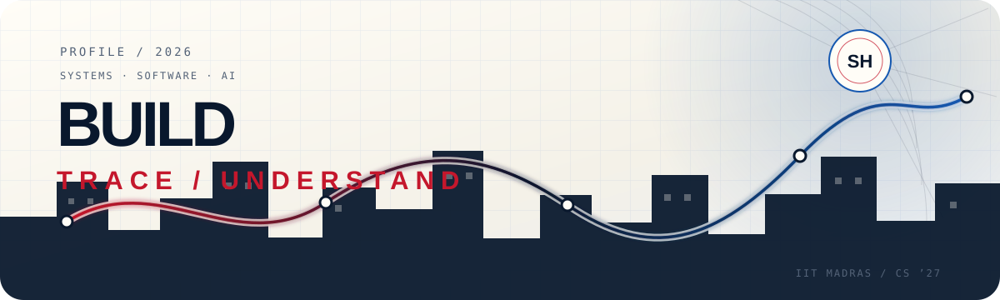

<picture>
  <source media="(prefers-color-scheme: dark)" srcset="./assets/readme/profile-hero-dark.svg">
  <source media="(prefers-color-scheme: light)" srcset="./assets/readme/profile-hero-light.svg">
  
</picture>

<h1 align="center">Surya Harshith Balla</h1>

<p align="center">
  <strong>I like building useful software.</strong><br>
  IIT Madras CS ’27 · backend, infrastructure, GPU observability, and AI/ML
</p>

<p align="center">
  <a href="https://spidey-harshithportfolio.vercel.app/"></a>
  <a href="mailto:bsharshith1808@gmail.com"></a>
  <a href="https://www.linkedin.com/in/harshith-balla-355199299"></a>
  <a href="https://codeforces.com/profile/Harshith7946"></a>
</p>

<p align="center">
  <sub>CHOOSE A ROUTE</sub><br>
  <a href="#experience">Experience</a>
  &nbsp;·&nbsp;
  <a href="#selected-project">Project</a>
  &nbsp;·&nbsp;
  <a href="#technical-toolkit">Toolkit</a>
  &nbsp;·&nbsp;
  <a href="#proof-points">Proof points</a>
  &nbsp;·&nbsp;
  <a href="#contact">Contact</a>
</p>

---

## About me

I am a Computer Science student at IIT Madras. I enjoy backend, infrastructure, and systems problems—understanding what went wrong, finding the mechanism behind it, and building a practical fix.

My work so far has taken me through GPU observability, full-stack products, deployment systems, code-execution pipelines, and agent-based simulations.

```text
currently tracing  → systems / backend / GPU observability
exploring next     → computer vision / reinforcement learning / autonomous systems
off-screen         → sketching / fitness
```

## Experience

> ### [NVIDIA](https://www.nvidia.com/)
> **System Software Engineer Summer Intern** · May–Jul 2026
>
> Prototyped workload observability for NVSentinel across B100, H100, and A100 GPU clusters.
>
> `Go` `eBPF` `CUDA` `Kubernetes` `DCGM` `Prometheus` `Grafana`

<details>
<summary><strong>Open the NVIDIA technical trail</strong></summary>

- Captured CUDA Runtime API activity with a Go/eBPF monitoring agent for future [NVSentinel](https://github.com/NVIDIA/NVSentinel) integration.
- Deployed node-wide collection as a Kubernetes DaemonSet and exposed Prometheus-compatible workload metrics.
- Connected DCGM telemetry to Prometheus, built PromQL-based Grafana dashboards, and reproduced GPU failure patterns to validate remediation behaviour.

</details>

> ### [Internhire](https://www.internhire.in/)
> **Software Engineering Co-op** · Feb–Mar 2026
>
> Worked across product and infrastructure as one of the startup’s early engineering interns.
>
> `Next.js` `PostgreSQL` `Docker` `CI/CD`

<details>
<summary><strong>Open the Internhire technical trail</strong></summary>

- Contributed across backend and frontend development.
- Built CI/CD pipelines for deployments on self-hosted infrastructure.

</details>

> ### [AlgoUniversity · YC S21](https://www.algouniversity.com/)
> **Software Engineering Co-op** · Jun–Jul 2025
>
> Built the core workflows of an online judge, from code execution to submissions and leaderboards.
>
> `Django` `React` `Docker` `AWS` `PostgreSQL` · [View the project →](https://github.com/harshith0518/WebDev-project-)

<details>
<summary><strong>Open the AlgoUniversity technical trail</strong></summary>

- Built a custom code-execution pipeline and JWT-authenticated APIs for problems, compilation, submissions, automated evaluation, and rankings.
- Containerized the backend and database services, deployed the frontend on Vercel, and used Amazon S3 for persistent storage.

</details>

## Selected project

### [Agent-Based Analysis of Epidemic Dynamics](https://spidey-harshithportfolio.vercel.app/#work)

**Course project under Prof. Danny Raj** · Jan–May 2025

Built an agent-based SIR simulation with core-periphery structure, stochastic mobility, proximity-based transmission, and time-varying NetworkX contact graphs.

`Python` `NetworkX` `NumPy` `PySINDy` `Matplotlib`

<details>
<summary><strong>Open the model notes</strong></summary>

- Modelled how individual movement becomes population-level epidemic behaviour using a published urban epidemic model as the starting point.
- Analysed segregation and modularity across time-varying contact graphs.
- Used PySINDy to identify candidate governing equations evaluated with R² and MAPE.

</details>

## Technical toolkit

**Languages** — Python · C · C++ · Go · TypeScript<br>
**Backend & systems** — Linux · eBPF · Django · Node.js · PostgreSQL · Redis<br>
**Cloud & observability** — AWS · Docker · Kubernetes · Prometheus · Grafana<br>
**Frontend** — React · Tailwind CSS · HTML · CSS<br>
**AI/ML & data** — CUDA · DCGM · NetworkX · scikit-learn · pandas · NumPy · Matplotlib

<details>
<summary><strong>Open the academic foundations</strong></summary>

Operating systems · computer networks · compiler design · databases · algorithms · computer architecture · machine learning · graph theory · probability and statistics

</details>

## Proof points

- **AIR 342** in JEE Main 2023, among nearly 1.1 million candidates.
- **AIR 580** in JEE Advanced 2023, among nearly 160,000 candidates.
- **Rank 99** in TS EAPCET 2023, among nearly 200,000 candidates.
- **1362** maximum Codeforces rating as [Harshith7946](https://codeforces.com/profile/Harshith7946).
- Selected among **50 participants from 1,700+ applicants** for the AlgoUniversity Accelerator Camp.

## Contact

If you are working on an interesting software, systems, infrastructure, or AI problem, [send me an email](mailto:bsharshith1808@gmail.com?subject=GitHub%20conversation). I am always happy to understand a good problem and see where I can help.

<p align="center">
  <a href="https://spidey-harshithportfolio.vercel.app/"><strong>enter the portfolio ↗</strong></a>
  &nbsp;·&nbsp;
  <a href="#surya-harshith-balla">replay from the top ↑</a>
</p>

<p align="center">
  <sub>build · trace · understand · improve</sub>
</p>
